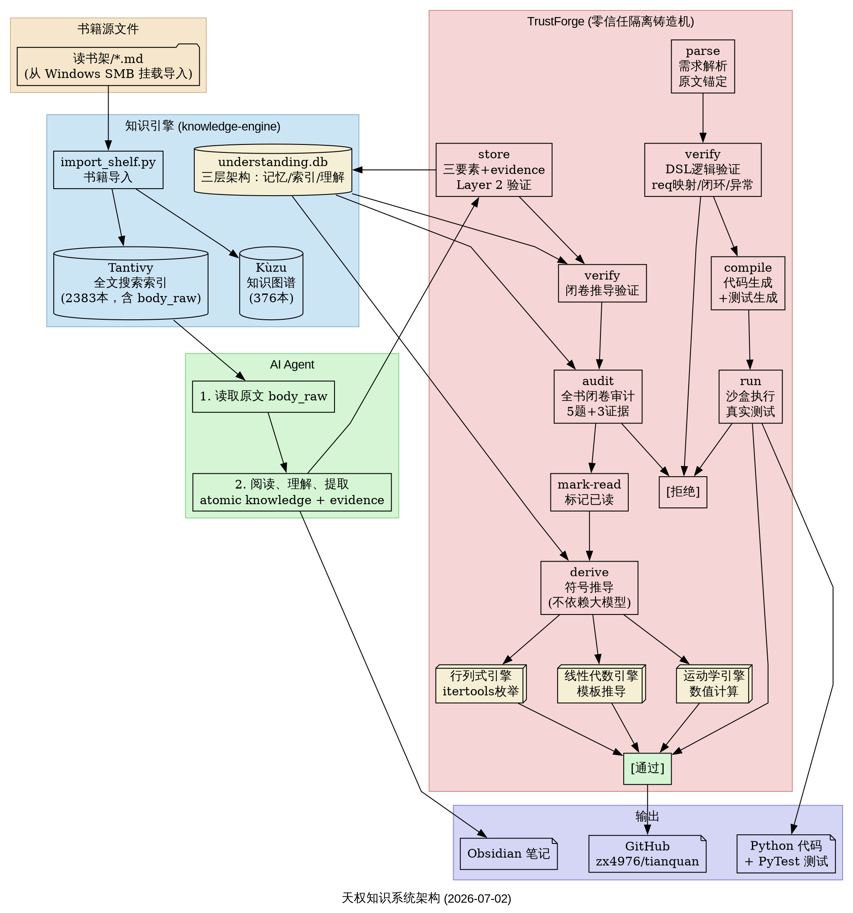

# Tianquan — 知识系统

一个将**书籍管理**、**知识理解**、**零信任验证**三者合一的知识系统。
解决的核心问题：**大模型输出的内容无法被信任**——它会编造、会走捷径、会假装理解了但实际上没有。

---

## 

```
┌─────────────────────────────────────────────────────────────────┐
│                        书籍源文件                                │
│             /读书架/*.md（从 Windows SMB 挂载导入）               │
└────────────────────────┬────────────────────────────────────────┘
                         │
                         ▼
┌─────────────────────────────────────────────────────────────────┐
│                    知识引擎（knowledge-engine）                   │
│                                                                  │
│  职责：书籍导入、索引、搜索、图谱管理                              │
│                                                                  │
│  ┌──────────────┐  ┌──────────────┐  ┌──────────────┐           │
│  │   Tantivy    │  │    Kùzu     │  │understanding │           │
│  │  全文搜索    │  │  知识图谱    │  │    .db       │           │
│  │  (2383本)   │  │  (376本)    │  │  理解数据    │           │
│  └──────────────┘  └──────────────┘  └──────────────┘           │
│         │                                    ▲                   │
└─────────┼────────────────────────────────────┼───────────────────┘
          │ 提供原文 (body_raw)                  │ 存入理解
          ▼                                    │
┌─────────────────────────────────────────────────────────────────┐
│               AI Agent                                             │
│                                                                  │
│  1. 从知识引擎读取原文                                            │
│  2. 阅读、理解、提取 atomic knowledge + evidence                  │
│  3. 调用 TrustForge 验证并存储                                    │
└────────────────────────┬────────────────────────────────────────┘
                         │
                         ▼
┌─────────────────────────────────────────────────────────────────┐
│                TrustForge（零信任隔离铸造机）                      │
│                                                                  │
│  职责：验证 AI 输出的真实性，拒绝一切无法提供证据的声明              │
│                                                                  │
│  ┌──────────────────────────────────────────────────────────┐   │
│  │              读书理解流程（understand 子命令）              │   │
│  │                                                          │   │
│  │  store ──→ verify ──→ audit ──→ mark-read ──→ derive     │   │
│  │   │           │           │            │          │       │   │
│  │   │ 三要素    │ 闭卷推导   │ 全书审计   │ 标记已读  │ 符号   │   │
│  │   │ +evidence│ 验证理解   │ 5题+3证据  │          │ 推导   │   │
│  │   ▼          ▼           ▼            ▼          ▼       │   │
│  └──────────────────────────────────────────────────────────┘   │
│                                                                  │
│  ┌──────────────────────────────────────────────────────────┐   │
│  │              软件开发流程（开发子命令）                     │   │
│  │                                                          │   │
│  │  parse ──→ verify ──→ compile ──→ run                    │   │
│  │   │           │            │          │                   │   │
│  │   │ 需求解析  │ 逻辑验证   │ 代码生成  │ 沙盒执行          │   │
│  │   │ +原文锚定 │ req映射    │ +测试生成  │ 真实测试          │   │
│  │   ▼          ▼            ▼          ▼                   │   │
│  └──────────────────────────────────────────────────────────┘   │
└─────────────────────────────────────────────────────────────────┘
```

---

## 两个核心组件

### 知识引擎（knowledge-engine）

**是什么**：书籍的导入、索引、搜索、图谱管理系统。

| 模块 | 功能 |
|------|------|
| Tantivy 索引 | 多语言分词、全文搜索、原始正文 (body_raw) 存储 |
| Kùzu 图谱 | 书籍元信息、分类关系、概念关联 |
| import_shelf | 从 Markdown 文件批量导入书籍 |
| understanding.db | 三层架构：记忆 / 索引 / 理解（物理隔离） |

**不做什么**：知识引擎不负责"理解"书籍内容。它只负责存储和检索。

---

### TrustForge（零信任隔离铸造机）

**是什么**：悬在 AI 输出之上的验证层。AI 说的每一句话、写的每一段代码、声称的每一个理解，都必须经过 TrustForge 验证才能算数。

**核心机制**：

```
说"我做完了" → TrustForge 检查 → 有证据？→ 通过
                                → 没证据？→ 退回
```

| 机制 | 防什么 |
|------|--------|
| DSL 只允许声明，不允许写控制流 | 防在代码里藏 return true |
| 沙盒真实执行测试 | 防假装测试通过 |
| Layer 2 evidence 字符串匹配 | 防编造原文引用 |
| 三要素强制约束（由来/核心/应用） | 防存无意义的"理解" |
| verify 闭卷推导 | 防存完后根本不会用 |
| 符号推导引擎 | 防推理依赖训练数据而非已学知识 |

---

## 组合应用流程

### 场景一：读书理解

```
1. 知识引擎导入书籍 → Tantivy + Kùzu
   （由 import_shelf.py 完成）

2. AI Agent 从 Tantivy 读取原文 (body_raw)
   trustforge understand info <book_id>

3. AI Agent 阅读章节 → 提取三要素 + evidence
   trustforge understand store --dim "第1章" --motivation "..." --content "..." --application "..." --evidence "..."

   ↓ TrustForge 验证 evidence 是否在正文中
   ↓ 不在 → 拒绝（可能是幻觉）
   ↓ 在 → 暂存为"待验证"

4. AI Agent 闭卷推导验证
   trustforge understand verify <book_id> --dim "第1章"
   ↓ 通过 → 标记"已理解"
   ↓ 失败 → 重读

5. 全书读完 → 闭卷审计
   trustforge understand audit <book_id>
   ↓ ≥80% 通过 → 标记已读
   ↓ <80% → 重读未掌握章节

6. 基于已存知识做符号推导
   trustforge understand derive <book_id> "证明子空间的交仍然是子空间"
   ↓ 输出推导步骤（标注"未调用大模型参数"）
```

### 场景二：软件开发

```
1. 编写需求文档 requirements.md

2. 知识引擎解析需求 →
   trustforge parse requirements.md
   → 输出 req_schema.json（需求切片 + 原文坐标锚定）

3. AI Agent 编写 DSL →
   logic.dsl.json（只声明实体/状态/API/校验规则）

4. TrustForge 验证 DSL →
   trustforge verify logic.dsl.json
   ↓ 验证 req 映射、状态闭环、异常覆盖
   ↓ 通过 → 编译
   ↓ 失败 → 退回修改

5. TrustForge 编译 →
   trustforge compile logic.dsl.json
   → 生成 models.py / state_machine.py / api.py / validators.py / tests/

6. TrustForge 沙盒执行 →
   trustforge run logic.dsl.json
   ↓ 测试全部通过 → 完成
   ↓ 有失败 → 退回修改
```

### 场景三：防幻觉闭环

```
AI Agent 说"我理解了线性空间"

TrustForge 追问：
  1. 它的由来是什么？（为了解决向量运算的抽象化）
     → evidence 在原文中？✅

  2. 它的核心定义是什么？（域K上的加法交换群+数乘四公理）
     → evidence 在原文中？✅

  3. 它能用来做什么？（线性映射、子空间、维数理论）
     → evidence 在原文中？✅

  4. 现在闭卷回答：证明子空间的交仍是子空间
     → 回答了非空/加法封闭/数乘封闭 ✅

→ 这条理解通过验证，存入 understanding.db
```

---

## 设计原则

> **理解不是我说我知道了，而是我能基于它做出正确的行动。**

1. **可追溯** — 每一条理解必须附带原文证据 (evidence)
2. **可验证** — 声称的功能必须经过真实执行测试
3. **可推导** — 存入的知识必须能用于实际推理
4. **可隔离** — 开发数据与 AI Agent 个人数据物理分离
5. **零信任** — 不信任任何文字声明，只信任可执行的证据

## 项目目录结构

```
/root/projects/
├── knowledge-engine/          # 知识引擎
│   ├── src/                   # 核心代码
│   │   ├── tantivy_index.py   # 全文搜索索引
│   │   ├── kuzu_graph.py      # 知识图谱
│   │   ├── understanding.py   # 理解模块（读写 understanding.db）
│   │   └── ...
│   ├── scripts/               # 工具脚本
│   │   ├── import_shelf.py    # 书籍导入
│   │   ├── algebra_engine.py  # 线性代数推导引擎
│   │   ├── determinant_engine.py # 行列式推导引擎
│   │   └── ...
│   └── data/                  # 数据文件（本地，不提交到 git）
│       └── understanding.db   # 理解数据（开发版）
│
├── trustforge/                # 零信任隔离铸造机
│   ├── trustforge/
│   │   ├── cli.py             # CLI 入口
│   │   ├── understand.py      # 读书理解模块
│   │   ├── determinant_engine.py # 符号推导引擎
│   │   ├── models.py          # DSL 数据模型
│   │   ├── validators/        # DSL 验证器
│   │   └── generators/        # 代码生成器
│   ├── examples/              # 用例
│   │   └── user_auth/         # 用户认证状态机示例
│   └── README.md              # TrustForge 详细文档
│
└── README.md                  # 本文件（总览）
```
